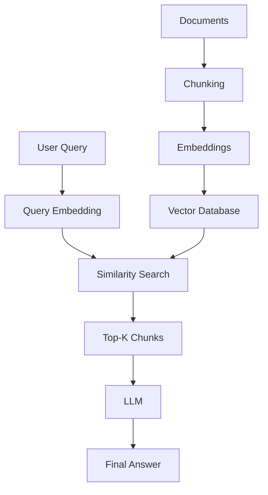

## 🔍 Top-K Retrieval

Instead of 1 result, retrieve **k best matches**.

### Why it matters:
- Better coverage
- Reduces missed information
- Improves answer quality

---

## 🧱 RAG Pipeline


#### Step-by-step:
1. Split documents into chunks
2. Convert chunks into embeddings
3. Store in vector database
4. Embed user query
5. Compute similarity
6. Retrieve top-k chunks
7. Generate answer with LLM

---

## 🧠 Why RAG Reduces Hallucinations

RAG grounds responses in real retrieved data, instead of relying only on training knowledge.

| System | Behavior                       |
| ------ | ------------------------------ |
| LLM    | Uses training data only        |
| RAG    | Uses external + retrieved data |

```mermaid
sequenceDiagram
    User->>System: Ask question
    System->>Embedding Model: Convert to vector
    System->>Vector DB: Search similar vectors
    Vector DB-->>System: Return top-k chunks
    System->>LLM: Provide context
    LLM-->>User: Answer