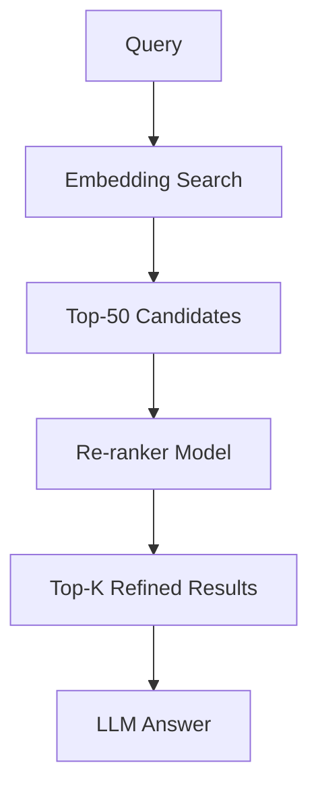

## 🔄 Re-ranking (Advanced Retrieval)

👉 After initial retrieval, we can improve results further.

Problem:

Embeddings are:

- Fast ✅
- Scalable ✅
- But sometimes coarse ❌
- Solution: Re-ranker model

#### A re-ranker:

- Takes query + chunk together
- Scores relevance more precisely
#### 🧱 Two-Stage Retrieval Pipeline
##### Stage 1: Retrieve (fast)
- Embed query
- Search vector DB
- Get top 20–50 candidates
##### Stage 2: Re-rank (accurate)
- Apply re-ranker model
- Sort by better relevance
- Select top few chunks

