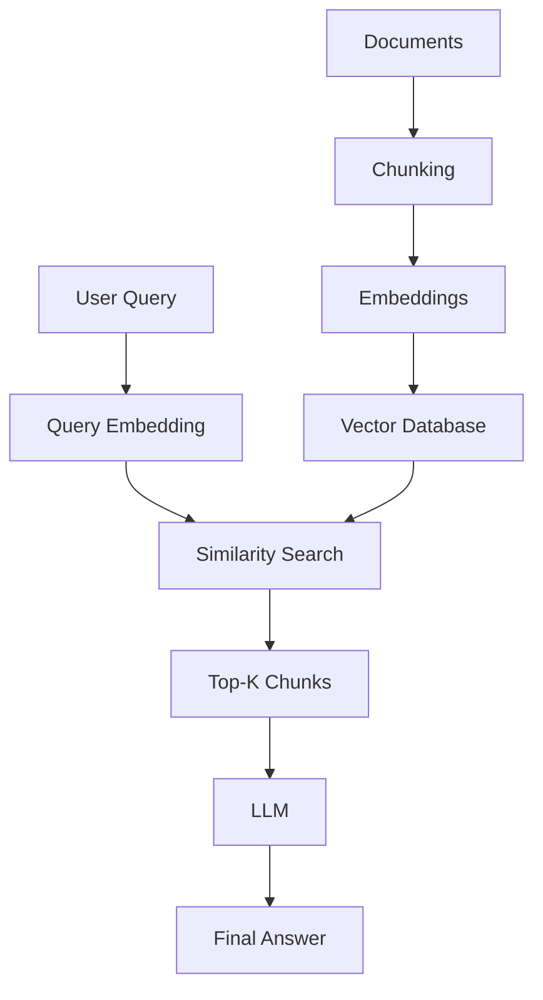
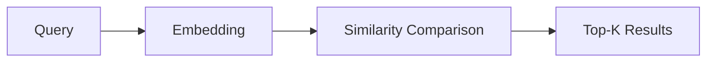
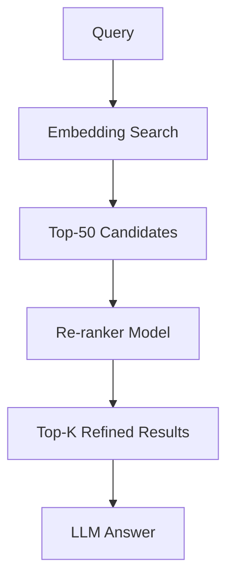
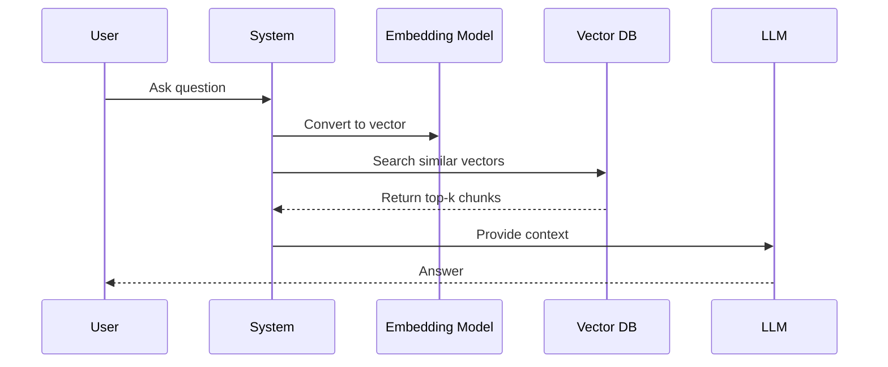

# 🧠 Embeddings, Retrieval, and RAG — Complete Guide

Understanding **embeddings**, **semantic search**, and the **RAG (Retrieval-Augmented Generation)** pipeline.

---

## 📌 Table of Contents

- [What are Embeddings?](#-1-what-are-embeddings)
- [Cosine Similarity](#-cosine-similarity)
- [Top-K Retrieval](#-top-k-retrieval)
- [RAG Pipeline](#-rag-pipeline)
- [Vector Databases](#-vector-databases)
---

## 🧠 1. What are embeddings?

Embeddings are **numerical vector representations of text** that capture semantic meaning.

👉 Example:
- "cat" → [0.21, -0.45, 0.88, ...]
- "dog" → [0.19, -0.40, 0.91, ...]

---


Similar meanings → similar vectors.

---

## 🔢 2. Why convert text into embeddings?

Computers process numbers, not words.

Embeddings allow:
- Semantic comparison
- Mathematical similarity
- Efficient search

---

## 📐 Cosine Similarity

Formula:

\[
\cos(\theta) = \frac{A \cdot B}{\|A\| \|B\|}
\]

### 📊 Interpretation

| Value | Meaning |
|------|--------|
| 1    | Very similar |
| 0    | Unrelated |
| -1   | Opposite |

---

## ✂️ Text Chunking

Splitting large text into smaller pieces.

### ⚖️ Tradeoffs

| Chunk Size | Problem |
|----------|--------|
| Too small | Not enough context |
| Too large | Mixed topics, poor precision |

### ✅ Ideal Size
**200–500 tokens**


## 🔑 Chunking Strategies

### 1. Fixed-size chunking
Split every **N tokens** (e.g., 300)

👉 Pros:
- Simple
- Fast

❌ Cons:
- Can break meaning mid-sentence

---

### 2. Sentence / Paragraph-based chunking

Split using natural boundaries.

👉 Pros:
- Better semantic meaning

❌ Cons:
- Uneven chunk sizes

---

### 3. Sliding Window (Overlapping chunks)

Example:
- Chunk 1: tokens 0–300
- Chunk 2: tokens 250–550


👉 Pros:
- Preserves context across chunks  
- Very common in production RAG  

---

## 🔥 Advanced Tip: Structure-Aware Chunking

👉 This is what **senior engineers actually do**

Instead of:
- Blind token splitting

Do:
- Split based on structure

### Example (FAQ)

Instead of breaking randomly:
```
Q: What is RAG?
A: Retrieval-Augmented Generation...
```

👉 Keep each **Q&A pair as one chunk**

✅ Benefits:
- Cleaner embeddings  
- Better retrieval accuracy  
- More meaningful context  

---

## 📏 Token Limits & Chunk Sizes

Why chunk size matters even more:

### 🔑 Constraints

1. **Embedding model limits**
   - Example: 8k tokens max input

2. **LLM context window**
   - Includes:
     - Query
     - Retrieved chunks
     - Prompt

---

### ⚖️ Tradeoffs

- Small chunks → lose context  
- Large chunks → lose precision  

👉 New constraint:
- Too many chunks → exceed context window  


---

## 🔍 Top-K Retrieval

Instead of 1 result, retrieve **k best matches**.

### Why it matters:
- Better coverage
- Reduces missed information
- Improves answer quality

---

## 🧱 RAG Pipeline


#### Step-by-step:
1. Split documents into chunks
2. Convert chunks into embeddings
3. Store in vector database
4. Embed user query
5. Compute similarity
6. Retrieve top-k chunks
7. Generate answer with LLM

## 📦 Vector Databases

A vector database stores embeddings and enables fast similarity search.

Popular options:
- FAISS
- Pinecone
- Weaviate
- Chroma



#### Steps:

- Convert query → embedding
- Compare with stored vectors
- Rank by similarity
- Return best matches


## 🔄 Re-ranking (Advanced Retrieval)

👉 After initial retrieval, we can improve results further.

Problem:

Embeddings are:

- Fast ✅
- Scalable ✅
- But sometimes coarse ❌
- Solution: Re-ranker model

#### A re-ranker:

- Takes query + chunk together
- Scores relevance more precisely
#### 🧱 Two-Stage Retrieval Pipeline
##### Stage 1: Retrieve (fast)
- Embed query
- Search vector DB
- Get top 20–50 candidates
##### Stage 2: Re-rank (accurate)
- Apply re-ranker model
- Sort by better relevance
- Select top few chunks




## 🔗 Why Embeddings Matter
- Capture meaning (not just keywords)
- Enable semantic search
- Improve retrieval accuracy

## 🧠 Why RAG Reduces Hallucinations

RAG grounds responses in real retrieved data, instead of relying only on training knowledge.

| System | Behavior                       |
| ------ | ------------------------------ |
| LLM    | Uses training data only        |
| RAG    | Uses external + retrieved data |



## 🧠 Why Similarity Scores Matter

- They rank relevance
- Prioritize best context
- Improve final answers

